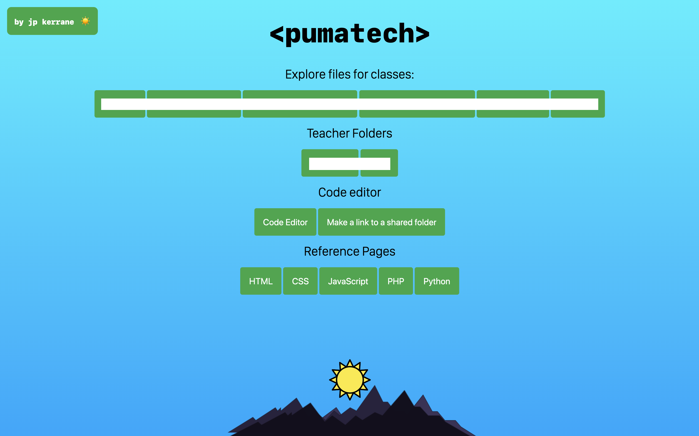
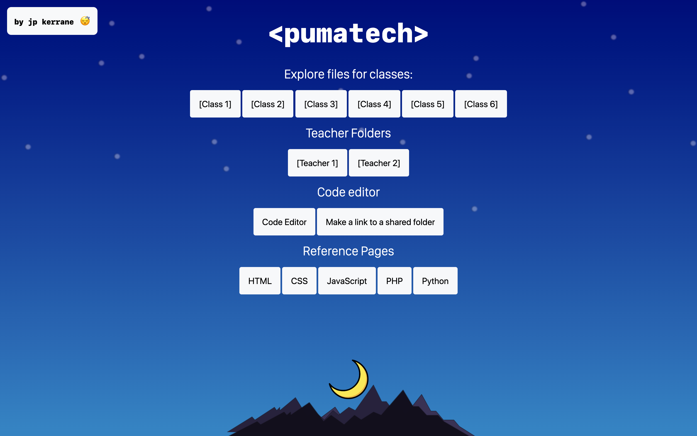
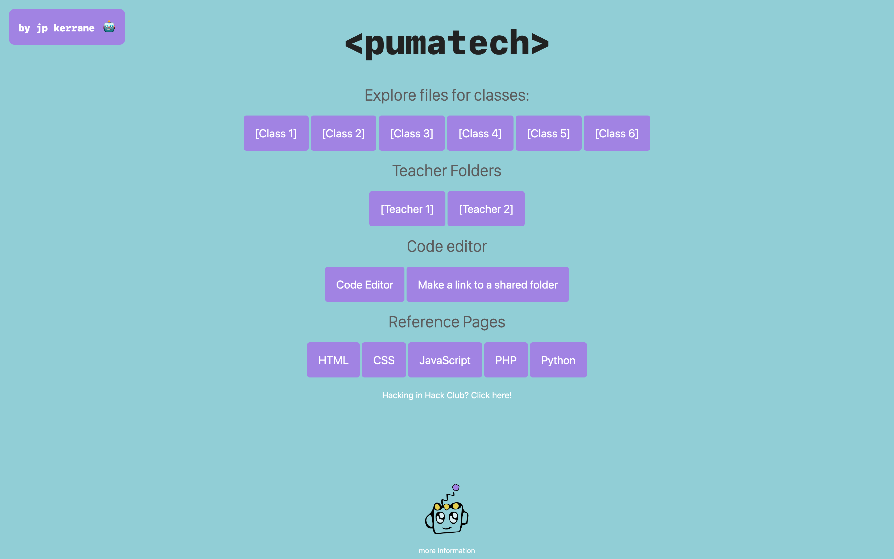

# pumatech-theme
**Theme for my middle/high school's tech server.**

My middle/high school has a tech server where we access things like our code editor for programming classes and other files. Most people at our school use the tech server to host their websites.

I made a front-page that changes based on the time of day. During the day time, it serves you a day theme, as well as night time based on the user’s clock. During [P2P Hack Club](https://p2phack.club/) meeting times, it shows a custom “Hack Club” theme.

Identifying informaton in the theme has been removed.

## Day Theme

## Night Theme

## [P2P Hack Club Theme](https://p2phack.club/) 

